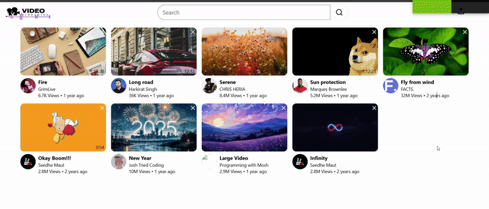
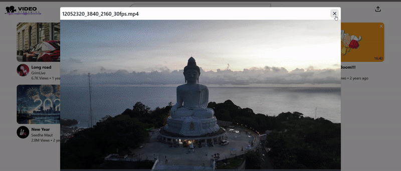
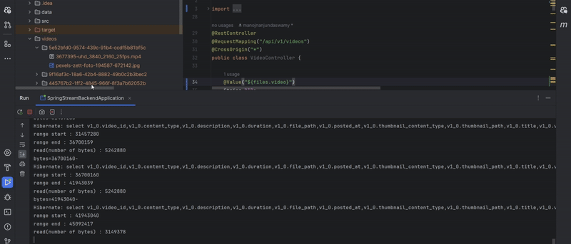

<div align="center">
  <h1 align="center">Video Streaming App</h1>
  
  <h3>
    Provides a seamless video streaming experience using modern technologies. It allows users to upload, view, and play videos with ease.
  </h3>
</div>

[Watch this video on YouTube](https://youtu.be/SAb4zRyxrD4?si=12KM7RjNj2XK1_9q)

<div style="display: flex; flex-wrap: wrap; gap: 2px;">

  <div style="flex: 1 1 calc(50% - 16px); box-sizing: border-box; min-width: 300px;">
    <h3>Hovering Effect</h3>
    
  </div>

  <div style="flex: 1 1 calc(50% - 16px); box-sizing: border-box; min-width: 300px;">
    <h3>Upload Video</h3>
    
  </div>

  <div style="flex: 1 1 calc(50% - 16px); box-sizing: border-box; min-width: 300px;">
    <h3>Stream Video</h3>
    
  </div>

  <div style="flex: 1 1 calc(50% - 16px); box-sizing: border-box; min-width: 300px;">
    <h3>Database</h3>
    
  </div>

  <div style="flex: 1 1 calc(50% - 16px); box-sizing: border-box; min-width: 300px;">
    <h3>Code Overview</h3>
    
  </div>  
  <div style="flex: 1 1 calc(50% - 16px); box-sizing: border-box; min-width: 300px;">
    <h3>Delete Video</h3>
    
  </div>

</div>

## 🚀 Features
- **Segmented Video Streaming:** Streams videos in segments, similar to real-world applications ☑️.
- **Video Upload:** Upload any video with thumbnails ☑️.
- **Thumbnail Display:** View videos with custom thumbnails ☑️.
- **High-quality video playback:** Supports HD and 4K streaming ☑️.
- **Multi-device Support:** Responsive design for both desktop and mobile. ☑️.
- **Channels:** Not Implemented ❌.
- **Search & Discovery:**  Not Implemented ❌.
- **Playlists:** Not Implemented ❌.
- **Comments & Ratings:** Not Implemented ❌.

## 🛠️ Tech Stack
- Frontend: [React](https://react.dev/), [Vite](https://vite.dev/), [Tailwind CSS](https://tailwindcss.com/), [flowbite](https://flowbite.com/), [react-toastify](https://www.npmjs.com/package/react-toastify), [video.js](https://videojs.com/guides/react/)

- Backend: [Spring Boot](https://spring.io/projects/spring-boot), [JPA](https://spring.io/projects/spring-data-jpa), [Rest API](https://spring.io/guides/tutorials/rest)

- Database: [H2 Database](https://www.h2database.com/html/main.html)

- Video Processing: [FFMPEG](https://www.ffmpeg.org/)

## 🏃‍♂️‍➡️ Getting Started
### Prerequisites
#### Here's what you need:

- JDK (version >= 21)
```shell
java -version
```
- Node.js and npm
```shell
node -v
npm -v
```
- FFMPEG
  - [Official site](https://www.ffmpeg.org/download.html)
  - Download & Installation guide - https://www.geeksforgeeks.org/how-to-install-ffmpeg-on-windows/ 
```shell
ffmpeg -version
```
- IDEs:
  - **Spring Boot:** IntelliJ IDEA, Eclipse, or Visual Studio Code with Java extensions.
  - **React:** Visual Studio Code or any other code editor.

### 1. Clone the repository
```shell
git clone https://github.com/manojnanjundaswamy/video-streaming-app.git
```

### 2. Install npm dependencies & react packages
```shell
cd stream-front-end
npm install
```

### 3. Run React app
```shell
npm run dev
```

### 4. Open spring-stream-backend in an IDE & run SpringStreamBackendApplication.java or
```shell
mvn clean
mvn spring-boot:run
```
- Spring-boot app will be running in [http://localhost:8080](http://localhost:8080/api/v1/videos)

### 5. Open the app in your browser
Visit [http://localhost:5173](http://localhost:5173/) in your browser.


## 🤝 Contributing
Contributions are what make the open-source community such an amazing place to learn, inspire, and create. Any contributions you make are **greatly appreciated**.

- Fork the Project
- Create your Feature Branch (`git checkout -b feature/AmazingFeature`)
- Commit your Changes (`git commit -m 'Add some AmazingFeature'`)
- Push to the Branch (`git push origin feature/AmazingFeature`)
- Open a Pull Request

## 📧 Contact
**LinkedIn** - [ManojNanjundaswamy](https://www.linkedin.com/in/manoj-nanjundaswamy/)  
**Mail** - manojnanjundaswamy@gmail.com  
**Project Link:** [https://github.com/manojnanjundaswamy/video-streaming-app](https://github.com/manojnanjundaswamy/video-streaming-app)
